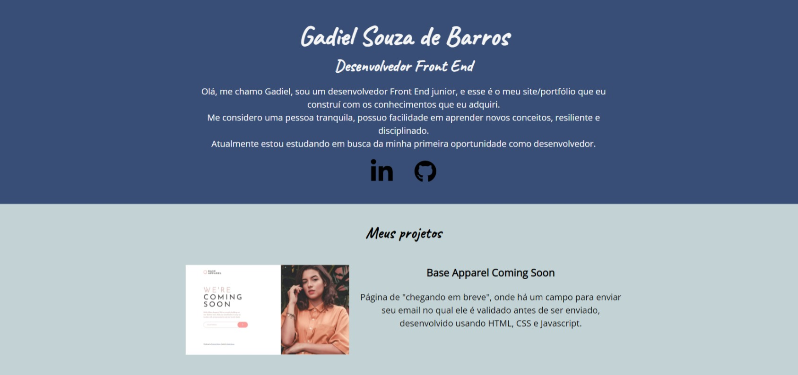

# Site Pessoal/Portfolio

Esse é um projeto guiado de um site pessoal/portfolio contendo meus projetos e mais informações sobre mim. 

## Screenshot

## Construído com

- HTML Semântico
- CSS
- Javascript
- Flexbox
- Grid
- Desktop-first workflow

## Links

- Link do site: (https://gadiel-s.github.io/meu-portfolio/)
- LinkedIn: (https://www.linkedin.com/in/gadielsouzafrontend/)
- Github: (https://github.com/Gadiel-S)
- Frontend Mentor - [@Gadiel-S](https://www.frontendmentor.io/profile/Gadiel-S)
